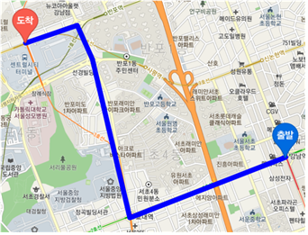

# Web_Dijkstra-algorithm-KAKAOMAP-API

#### 각 지점의 좌표명: latlng_final.json 참고

#### 다익스트라 알고리즘을 통한 경로 안내
1. link.py를 통해 링크아이디의 시점명과 종점명 알아냄->linkId2.json
2.  toGraph.py를 통해 그래프 생성->graph.txt
3.  final.py에서 다익스트라 알고리즘을 통해 경로 안내
4.  map_woo.html이 결과화면

#### 결과

##
- 💻 **Computer specs used to train the model**
        CPU : i5-7300HQ, GPU : GTX 1050 4GB

- 📒  **Data used to train the model** : 
        https://topis.seoul.go.kr/refRoom/openRefRoom_1.do

- 📮  **Contact us : sheewons@naver.com or u_rim@naver.com**

- 🇰🇷  **Department of Information and Communication Engineering, Hankuk University of Foreign Studies**
